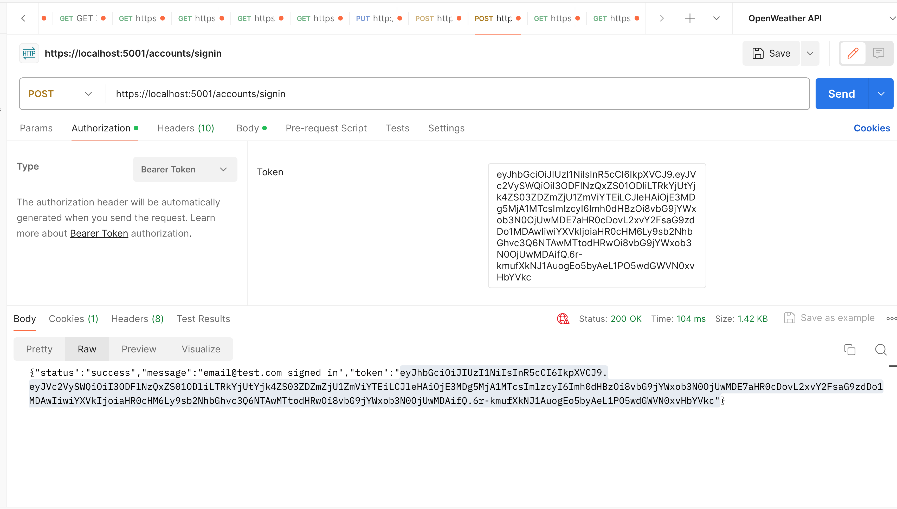

<br>
<p align="center">
  <u><big>|| <b>Animal Shelter Api</b> ||</big></u>
</p>
<p align="center">
      ___________________________
    </p>
    <!-- GitHub Link -->
    <p align="center">
        <a href="https://github.com/MonBoza">
            <strong>MonBoza</strong>
        </a>
    </p>
    <!-- Project Shields -->
    <p align="center">
        <a href="https://github.com/MonBoza/AnimalShelterApi.Solution/graphs/contributors">
            
        </a>
        ¨
        <a href="https://github.com/MonBoza/AnimalShelterApi.Solution/stargazers">
            
        </a>
        ¨
        <a href="https://github.com/MonBoza/AnimalShelterApi.Solution/issues">
            
        </a>
        ¨
        <a href="https://github.com/MonBoza/Best-ReadMe-Template/blob/master/LICENSE.txt">
            
        </a>
        ¨
        <a href="https://linkedin.com/in/MonBoza">
            
        </a>
    </p>    
</p>

<p align="center">
  <small>Initiated February 23, 2024</small>
</p>

<!-- Project Links -->
<p align="center">
    <a href="https://github.com/MonBoza/AnimalShelterApi.Solution"><big>Project Docs</big></a> ·
    <a href="https://github.com/MonBoza/AnimalShelterApi.Solution/issues"><big>Report Bug</big></a> ·
    <a href="https://github.com/MonBoza/AnimalShelterApi.Solution/issues"><big>Request Feature</big></a>
</p>

------------------------------
### <u>Table of Contents</u>
* <a href="#🌐-about-the-project">About the Project</a>
    * <a href="#📖-description">Description</a>
    * <a href="#🦠-known-bugs">Known Bugs</a>
    * <a href="#🛠-built-with">Built With</a>
    <!-- * <a href="#🔍-preview">Preview</a> -->
* <a href="#🏁-getting-started">Getting Started</a>
    * <a href="#📋-prerequisites">Prerequisites</a>
    * <a href="#⚙️-setup-and-use">Setup and Use</a>
* <a href="#🛰️-api-documentation">API Documentation</a>
* <a href="#🤝-contributors">Auxiliary</a>
    * <a href="#🤝-contributors">Contributors</a>
    * <a href="#✉️-contact-and-support">Contact</a>
    * <a href="#⚖️-license">License</a>
    * <a href="#🌟-acknowledgements">Acknowledgements</a>
    
------------------------------

## About the Project

### 📖 Description

The primary purpose of the Animal Shelter API is to assist users in exploring the animal shelter database to find available cats and dogs for adoption. This API follows RESTful principles, "potentially  pagination" and employs integrated authentication to maintain a read-only status for regular users, reserving modification privileges for administrators. Users have the option to use Postman to examine the current operational version of the API.

### Known Bugs

* I am not sure yet.

### Technologies Used

* [Visual Studio Code](https://code.visualstudio.com/)
* [C#](https://docs.microsoft.com/en-us/dotnet/csharp/)
* [ASP.NET Core MVC](https://docs.microsoft.com/en-us/aspnet/core/mvc/overview?view=aspnetcore-3.1)
* [MySQL](https://dev.mysql.com/)
* [Entity Framework Core 2.2.6](https://docs.microsoft.com/en-us/ef/core/)
* [Swagger - NSwag 13.3.0](https://docs.microsoft.com/en-us/aspnet/core/tutorials/getting-started-with-nswag?view=aspnetcore-3.1&tabs=visual-studio)
* [Postman](postman.com)

------------------------------

## Setup/Installation Requirements

This Project assumes you have MySql Server and Workbench  installed if you do not have them installed follow along with these lessons at
[Learn how to program](https://full-time.learnhowtoprogram.com/c-and-net/getting-started-with-c/installing-and-configuring-mysql).

## Install Postman

(Optional) [Download and install Postman](https://www.postman.com/downloads/).

### Setup and Installation

  1) Navigate to the [Animal Shelter API repository here](https://github.com/MonBoza/AnimalShelterApi.Solution).
  2) Open up your system Terminal or GitBash, navigate to your desktop with the command: `cd Desktop`, or whichever location suits you best.
  3) Clone the repository by running the following command to your desktop:

    git clone https://github.com/MonBoza/AnimalShelterApi.Solution.git
     
  4) Run the command `cd AnimalShelterApi.Solution` to enter into the project directory.
  5) View or Edit:
      * Code Editor - Run the command `code .` to open the project in VisualStudio Code respectively for review and editing.

  6) Within the production directory `AnimalShelterApi`, create new file called `appsettings.json`

  7) Make sure appsettings.json is added to the .gitignore file and it is added to the repository before pushing with your personal information.
  8)  Within `appsettings.json`, put in the following code replacing the `uid` and the `pwd` values with your own username and password for MySQL.

    {
    "Logging": {
        "LogLevel": {
        "Default": "Warning"
        }
    },
    "AllowedHosts": "*",
    "ConnectionStrings": {
        "DefaultConnection": "Server=localhost;Port=3306;database=animal_shelter_api;uid=[YOUR-USERNAME-HERE];pwd=[YOUR-PASSWORD-HERE];"
    },
    "JwtSettings": {
        "ValidAudience": "example-audience",
        "ValidIssuer": "example-issuer",
        "SecretKey": "[YOUR-SECRET-HERE]"
  }
}

 9) In order to properly implement JSON Web Tokens for API authorization, replace [YOUR-SECRET-HERE] with your own personalized requirement string.
 The Secret is a string used to encode JWTs,  Depending on what type of algorithm being used, the Secret string will need to be a certain length. In this case, it needs to be at least 32 characters long.

### To set upDatabase

  1) Navigate to AnimalShelterApi.Solution/AnimalShelterApi directory using the MacOS Terminal or Windows Powershell (e.g. `cd Desktop/AnimalShelterApi.Solution/AnimalShelterApi`).
  2) Run the command `dotnet ef database update` to generate the database through Entity Framework Core.
  3) (Optional) To update the database with any changes to the code, run the command `dotnet ef migrations add <MigrationsName>` which will use Entity Framework Core's code-first principle to generate a database update. After, run the previous command `dotnet ef database update` to update the database.

#### Launch the API

  1) Navigate to AnimalShelterApi.Solution/AnimalShelterApi directory using the MacOS Terminal or Windows Powershell (e.g. `cd Desktop/AnimalShelterApi.Solution/AnimalShelterApi`).
  2) Run the command `dotnet run` to have access to the API in Postman or browser.

------------------------------

##  API Documentation

Explore the API endpoints in Postman or a browser. You will not be able to utilize authentication in a browser.

### Using Swagger Documentation

To explore the Animal Shelter API with NSwag, launch the project using `dotnet run` with the Terminal or Powershell, and input the following URL into your browser: `http://localhost:5001/swagger`

### Using the JSON Web Token

In order to be authorized to use the POST, PUT, DELETE functionality of the API, please authenticate yourself through Postman.
* Open Postman and create a POST request using the URL: `http://localhost:5000/api/users/authenticate`
* Add the following query to the request as raw data in the Body tab:
<!-- fix this -->
{
    "UserName": "ShelterAdmin",
    "Password": "epicodus"
}

* The token will be generated in the response. Copy and paste it as the Token parameter in the Authorization tab.

### Note on CORS

CORS is a W3C standard that allows a server to relax the same-origin policy. It is not a security feature, CORS relaxes security. It allows a server to explicitly allow some cross-origin requests while rejecting others. An API is not safer by allowing CORS.
For more information or to see how CORS functions, see the [Microsoft documentation](https://docs.microsoft.com/en-us/aspnet/core/security/cors?view=aspnetcore-2.2#how-cors).


### Registering an Account using the JSON Web Token

In order to be authorized to use the `POST`, `PUT` and `DELETE` functionality of the API you must first authenticate yourself.

#### Registration

Using Postman, we will setup a `POST` request to the `accounts\register` endpoint. Select the body tab, choose the 'raw' selection and select 'JSON' from the dropdown selection.

In the body of the Post request, use the following format:

```json
{
    "email": "email@testEmail.com",
    "userName": "TestName",
    "password": "Password1"
}
```

- Note that the password must contain at least six characters, one non-alphanumeric character, at least one digit lowercase letter, at least one uppercase letter and at least two unique characters.

### Using the JWT

First SignIn to your account using this endpoint

`https://localhost:5001/accounts/SignIn`

then in the body sign in using your email and password in JSON format

```json
{
    "email": "email@testEmail.com",
    "password": "Password1"
}

```

We want to copy the token token given in the body and navigate to the `Auth` tab and select `Bearer Token`, and then paste the token in the empty field to the right here is an example of how it should look.



you should now be able to use the api.

### Endpoints

Base URL: `https://localhost:5001`

#### HTTP Request Structure

```
GET /api/{component}
POST /api/{component}
GET /api/{component}/{id}
PUT /api/{component}/{id}
DELETE /api/{component}/{id}
```

#### Example Query

`https://localhost:5001/api/Dogs/1`

#### Sample JSON Response
```json
  {
  "dogId":1,
  "name":"Rex",
  "age":3,
  "description":"A fluffy puppy, kid friendly and loves to play"
  }
```

..........................................................................................

### Cats
Access information on available cats at the shelter.

#### HTTP Request
```
GET /api/Cats
POST /api/Cats
GET /api/Cats/{id}
PUT /api/Cats/{id}
DELETE /api/Cats/{id}
```

#### Path Parameters
| Parameter | Type | Default | Required | Description |
| :---: | :---: | :---: | :---: | --- |
| name | string | none | false | Return matches by name.
| Age | int | none | false | Return any cat at a specific age. |
| Description | string | none | false | Return cat matches with a phrase in description. |

#### Example Query
`https://localhost:5000/api/cat/?name=esther`

#### Sample JSON Response

```
{
        "catId": 1,
        "name": "Esther",
        "age": 9,
        "description": "A sassy old lady who loves to lay around and judge"
}
```

..........................................................................................

### Dogs

Access information available dogs in the shelter.

#### HTTP Request
```
GET /api/Dogs
POST /api/Dogs
GET /api/Dogs/{id}
PUT /api/Dogs/{id}
DELETE /api/Dogs/{id}
```

#### Path Parameters
| Parameter | Type | Default | Required | Description |
| :---: | :---: | :---: | :---: | --- |
| name | string | none | false | Return matches by name.
| Age | int | none | false | Returns dogs with specified age. |
| Description | string | none | false | Return dog with specified phrase matching description. |


#### Path Parameters

| Parameter | Type | Default | Required | Description |
| :---: | :---: | :---: | :---: | --- |
| name | string | none | false | Return matches by name.
| description | string | none | false | Return any Cat or Dog with a specific description. |

#### Example Query

```bash
https://localhost:5001/api/Dogs?name=wiggles
```

#### Sample JSON Response

```json
{
  "dogId":1,
  "name":"Rex",
  "age":3,
  "description":"A fluffy puppy, kid friendly and loves to play"}
```

------------------------------

### Contributors

| Author | GitHub | Email |
|--------|:------:|:-----:|
| [Monica Barboza](https://linkedin.com/in/MonBoza) | [MonBoza](https://github.com/MonBoza) |  [monboza@gmail.com](mailto:monboza@gmail.com) |

------------------------------

### ✉️ Contact and Support

If you have any feedback or concerns, please contact one of the contributors.

<p>
    <a href="https://github.com/MonBoza/AnimalShelterApi.Solution/issues">Report Bug</a> ·
    <a href="https://github.com/MonBoza/AnimalShelterApi.Solution/issues">Request Feature</a>
</p>

------------------------------

### ⚖️ License

This project is licensed under the [MIT License](https://opensource.org/licenses/MIT). Copyright (C) 2024 Monica Barboza. All Rights Reserved.

```
Copyright (c) 2024 Monica Barboza

Permission is hereby granted, free of charge, to any person obtaining a copy
of this software and associated documentation files (the "Software"), to deal
in the Software without restriction, including without limitation the rights
to use, copy, modify, merge, publish, distribute, sublicense, and/or sell
copies of the Software, and to permit persons to whom the Software is
furnished to do so, subject to the following conditions:

The above copyright notice and this permission notice shall be included in all
copies or substantial portions of the Software.

THE SOFTWARE IS PROVIDED "AS IS", WITHOUT WARRANTY OF ANY KIND, EXPRESS OR
IMPLIED, INCLUDING BUT NOT LIMITED TO THE WARRANTIES OF MERCHANTABILITY,
FITNESS FOR A PARTICULAR PURPOSE AND NONINFRINGEMENT. IN NO EVENT SHALL THE
AUTHORS OR COPYRIGHT HOLDERS BE LIABLE FOR ANY CLAIM, DAMAGES OR OTHER
LIABILITY, WHETHER IN AN ACTION OF CONTRACT, TORT OR OTHERWISE, ARISING FROM,
OUT OF OR IN CONNECTION WITH THE SOFTWARE OR THE USE OR OTHER DEALINGS IN THE
SOFTWARE.
```